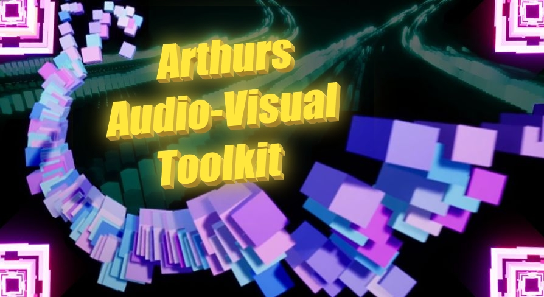

 

# Arthurs Audio BPs
A free, downloadable project full of next-gen audio & physics blueprints!!!
Made with Unreal Engine 4.27 (5.0.3 version exists, with limited functionality. Only available through the zip downloads link for now)

# itch.io store
Name your price for my 'games' here: https://diggart.itch.io/ 

# Zip downloads: 
http://bit.ly/2Ow025P

# Chat/Discord:
https://discord.gg/dKAshs7 

# Discussion/more info: 
https://forums.unrealengine.com/development-discussion/audio/1618651

# Feature Examples

- Huge hub-level with gamemode, doors to all levels, lots of silly BPs and more.
- "Candy" Audio Visualizer
- Jump-pads that trigger samples(audio)
- Submix meters(practical and simple in-world volume visualizers for submixes)
- Submix recording example(to soundwave or .wav)
- Independent pitch and playback-speed control with granular player(thank you for HQ voice sample [Megagoth1702](https://forums.unrealengine.com/community/got-skills-looking-for-talent/looking-for-work/1710171))
- SpringKeys, a physical, springy piano synthesizer instrument
- Granular chord choir music instrument thing
- Basic Modulation Plugin example
- Spline-based variation on the frequency visualizers
- Single frequency audio-visualizer boxes as standalone things
- Crowd sim early alpha
- Live Submix Effect-tweaker knob
- Modulation plugin example
- More musical Rollplate-examples added
- Rollplates; an evolution of the existing noteplates. Registers rolling objects as well, and uses physics for note velocity.
- Source effects(user modulation while simulating)
- NoteRunner; synth music based on physics and world-Z
- Midi input/output
- Spatial propagation
- Modular Synth Preset Randomizer
- Spatial music
- Mic/Input capture
- 3 different audio capture examples(incl recording and visualizing mic without hearing ourselves)
- Modular Synth
- visualization with single sound envelope followers
- submix FFT frequency analyzers and visualizers
- granular synthesis based door-hinges
- TimeSynth working as drum machine
- SourceBus, Submix and SourceEffect routing

# Overview videos for each release:
- V1001 5.0.3: Same as 1001 but in UE5. Some stuff does not work, but a lot does!
- V1001: No idea what I did here, but it was cool
- V1000...: Everything is finally set in stone! For now lol. This means videos is the logical next step LETS GOOOO :)
- V9.9.9.7: in the middle of the last transformation, so just a teaser now https://youtu.be/dq5x6IP1YWE
- V9.9.9 erview-video: we got this far together..now truly it is close, getting ready to set things in stone and make lots of videos!!!
- V9.8 erview-video: well OK now I'm saving up for a big v1.0 video..!
- V9.6 erview-video: ehehehheh
- V9.6 erview-video: errrr
- V9 overview-video: ON THE WAY
- V8 overview-video: https://youtu.be/8XcHyu8yTN0
- V7 overview-video: https://youtu.be/dtfeVrcapfQ
- V6 overview-video: https://youtu.be/DFUkmvU2N9c

